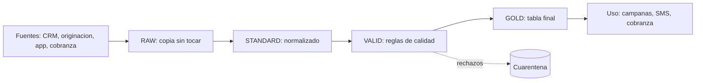
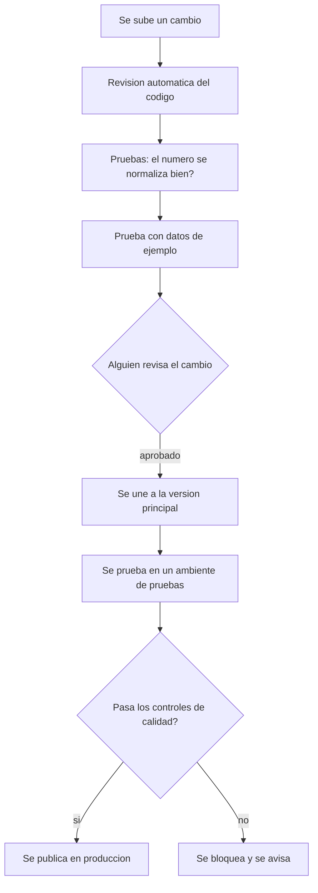

# Ejercicio 1 - Dataset de numeros de telefono de clientes

## 1. ¿Cúal es el problema?

El problema no es tecnico, el problema es que no se ponen de acuerdo las fuentes. Un mismo cliente puede tener diferentes números en el CRM, en el sistema de origen del crédito, en la app y en cobranzas. Ninguna fuente es “la correcta” en todo momento: cada una es mejor en distintos momentos.

Si uno hace un simple UNION de todo, termina con 3 o 4 numeros por cliente y nadie sabe cual usar. De ahí que haya que resolver dos preguntas:

1. Cual es el mejor número para contactar a este cliente hoy (el dataset final que usa el negocio)
2. De donde salio ese número y por qué se eligio ese y no otro (trazabilidad)

## 2. Como se organiza el dato (arquitectura por capas)



**RAW** - se guarda el dato tal como llega, sin cambiar nada, y se marca de que fuente vino y cuando llego. Sirve para poder volver atras si algo sale mal y para responder ¿por que el mes pasado este cliente tenia otro numero?.

**STANDARD** - Se normaliza el numero a un formato unico, el estandar internacional (ejemplo: +573001234567). Es donde se limpia la basura tipica:

| Como llega | Como queda | Que se hizo |
|---|---|---|
| 300 123 4567 | +573001234567 | se quitan espacios |
| (604) 4441122 | +576044441122 | se agrega indicativo |
| 03153334455 | +573153334455 | se quita el prefijo de larga distancia |
| 3001234567890 | se rechaza | tiene mas digitos de los que debe |

Tambien se marca si el numero es celular o si es fijo, ya que su tipo importa: no tiene sentido enviar un SMS a un numero fijo.

**VALID** - aquí se aplican las reglas de calidad. Se filtra y se clasifica:

- Si el numero cumple el formato correcto
- Si un mismo numero esta repetido en demasiados clientes (puede ser un error o puede ser el numero de un asesor que quedo mal cargado)
- Si el numero realmente contesta cuando se le llama (esto se sabe por el resultado de las gestiones de los call centers)
- Que tan viejo es el dato (si no se ha actualizado en 2 años, probablemente ya cambio)

Lo importante: nada se borra en silencio. Lo que no pasa una regla se manda a una tabla de "cuarentena" con el motivo del rechazo, para poder revisarlo despues.

**GOLD** - la tabla final que usa el negocio, con un numero principal por cliente:

```sql
CREATE TABLE telefono_cliente (
    id_cliente           STRING,
    telefono             STRING,      -- formato +57...
    tipo                 STRING,      -- MOVIL o FIJO
    fuente               STRING,      -- de donde salio
    score_confianza      DECIMAL,     -- que tan confiable es, de 0 a 100
    es_principal         BOOLEAN,     -- si es el numero que se usa
    fecha_actualizacion  TIMESTAMP
)
```

## 3. ¿Como se decide cual numero usar cuando hay varios?

Se le da un puntaje a cada numero (score de confianza) y gana el que tenga mas puntos. El puntaje se calcula con una formula simple y clara, no algo escondido en el codigo:

```
puntaje = 40% que tan reciente es el dato
        + 30% si contesto cuando lo llamaron antes
        + 20% que tan confiable es la fuente de donde salio
        + 10% si varias fuentes coinciden en el mismo numero
```

Estos porcentajes se guardan en una tabla de configuración, no metidos directo en el codigo. Asi, si el negocio quiere cambiar los pesos, no hay que modificar nada de programacion.


## 4. El proceso de CI/CD (control automatico de calidad antes de publicar)



**¿Que se guarda en Git:?** todo. No solo el codigo, tambien las reglas de calidad, la definicion del puntaje y la documentacion. Si algo no esta en Git, no se puede revisar ni volver atras si algo sale mal.

**¿Que bloquea que algo se publique:?**

| Control | Se bloquea si... |
|---|---|
| Pruebas del codigo | alguna prueba falla |
| Cantidad de filas | cambia mas de 10% sin razon |
| Llave duplicada | hay clientes repetidos como principal |
| Numeros validos | menos del 95% pasa la normalizacion |

La idea central: si algo esta mal, el proceso se detiene solo, no publica con una advertencia. Un dataset de telefonos malo significa mandar campanas a numeros equivocados, y eso cuesta plata real.

**¿Como se publica:?** primero se escribe en una tabla temporal, se revisa que todo este bien, y solo ahi se reemplaza la tabla que usa el negocio. Asi nadie ve nunca una version a medio hacer.


## 5. Matenimiento:

- Cada día se introducen nuevas modificaciones y, una vez a la semana, se realiza una carga completa para garantizar que nada quede desincronizado.
- Cuando el número principal de un cliente cambia, el anterior se guarda con la fecha en que dejó de ser el principal (esto se llama historización). Con esto no se puede saber que número se utilizó en una campana de hace 3 meses.
- El resultado de cada llamada (contesto, no contesto, numero equivocado) se guarda y sirve para mejorar el puntaje de confianza del número. Así el dataset va mejorando con el tiempo en vez de quedarse estático.

## 6. Cosas que se estan asumiendo:

- Hay un identificador unico de cliente que es el mismo en todos los sistemas. Si no existiera habria que resolver eso primero antes de este proyecto.
- El volumen de datos justifica el uso de herramientas de procesamiento distribuido (como Spark) con menos datos, una base de datos normal funciona igual de bien.