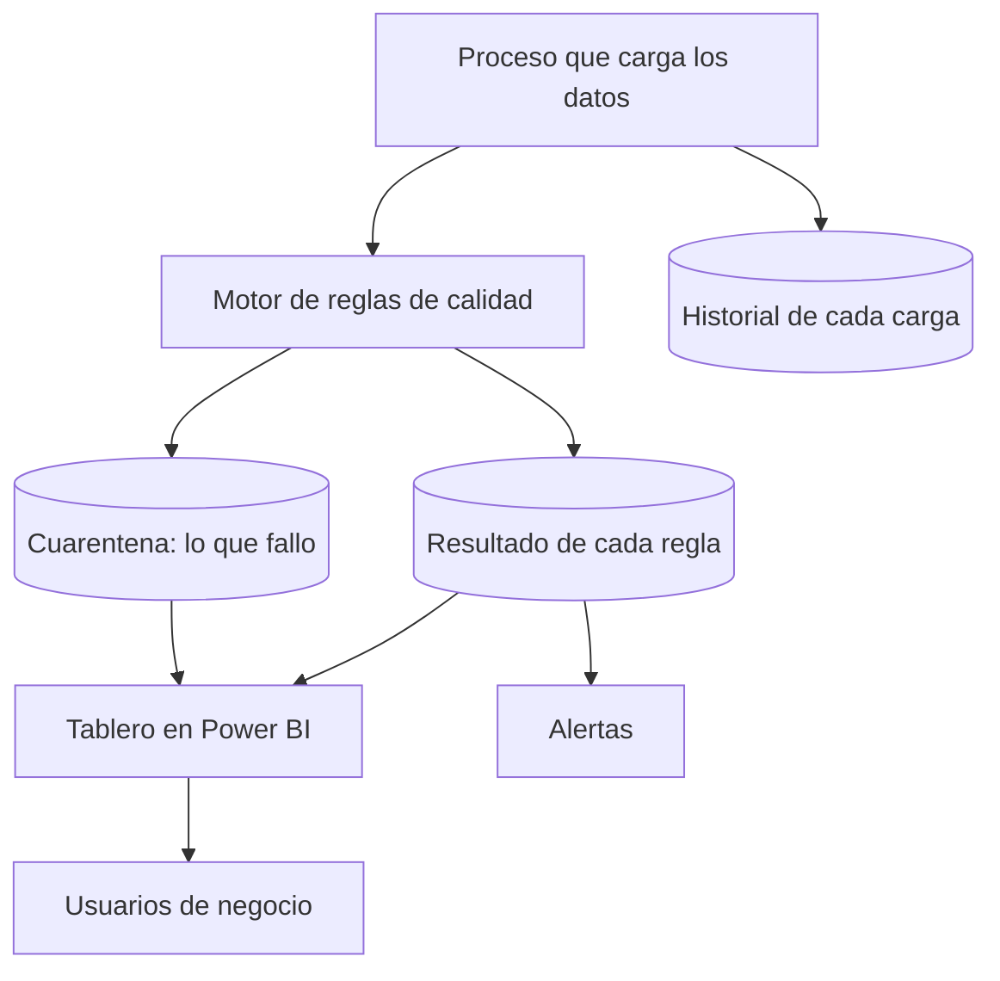

# Ejercicio 2 - Mecanismo de veeduria para la calidda y trazabilidad

## 1. ¿Cuál es el problema?

El datasets del ejercicio uno puede ser correcto técnicamente y aun así no se puede usar. Lo que hace que un área de negocio confíe en un dato no es que exista, sino que pueda comprobarlo por su cuenta sin depender del equipo de datos.

Por eso este mecanismo no es un tablero de monitoreo técnico. Es una herramienta de autogestión para negocio, con dos capacidades:

- **Veeduría**: ¿qué tan bueno es dato hoy y hacia dónde va?

- **Trazabilidad**: ¿de dónde salió este valor específico?


## 2. Las seis cosas que se miden (dimensiones de calidad)

Se usan 6 categorias que son un estandar conocido en la industria (se llaman DAMA-DMBOK), para no inventar criterios propios:

| Categoria | Que pregunta responde | Ejemplo con telefonos |
|---|---|---|
| Completitud | Falta informacion? | % de clientes que tienen al menos un telefono |
| Validez | Cumple el formato? | % de numeros bien normalizados |
| Unicidad | Hay duplicados raros? | % de numeros que se repiten en mas de 3 clientes |
| Consistencia | Las fuentes coinciden? | % de clientes con el mismo numero en todos los sistemas |
| Actualidad | Esta al dia? | % de numeros con mas de 2 anos sin actualizarse |
| Exactitud | Es correcto de verdad? | % de llamadas donde el cliente si contesto |

La exactitud es muy difícil de medir. No se puede comparar con el sistema, solo con la realidad. Por eso se usa el resultado real de las llamadas, como si contestaron o no, para saber si los datos son correctos.

## ¿cómo se arma?


### ¿Cómo se guardan las reglas?

```sql
-- Las reglas se guardan como datos en una tabla, no escritas en el codigo.
-- Asi, agregar una regla nueva no necesita que un programador haga un cambio.
CREATE TABLE regla_calidad (
    id_regla       STRING,
    dataset        STRING,
    dimension      STRING,   -- Completitud, Validez, etc
    descripcion    STRING,   -- explicada en lenguaje simple
    condicion_sql  STRING,   -- lo que se debe cumplir
    umbral_alerta  DECIMAL,  -- si baja de esto, se avisa
    umbral_bloqueo DECIMAL,  -- si baja de esto, se detiene el proceso
    responsable    STRING,
    activa         BOOLEAN
)

-- Aqui se guarda el resultado de cada revision, con fecha,
-- para poder ver si la calidad mejora o empeora con el tiempo.
CREATE TABLE resultado_regla (
    id_corrida      STRING,
    id_regla        STRING,
    fecha           TIMESTAMP,
    total_evaluado  BIGINT,
    total_correcto  BIGINT,
    porcentaje      DECIMAL,
    estado          STRING    -- OK, ALERTA o BLOQUEO
);
```

### Trazabilidad: de donde salió el dato

Esto se puede ver en tres niveles:

1. **A nivel de estructura**: qué columna de origen llena qué columna del resultado final. Se puede mostrar como un diagrama.

2. **A nivel de ejecución**: qué carga (corrida del proceso) generó cada resultado, cuándo se ejecutó, con qué versión del código. Sin esto no se puede repetir un resultado anterior.

3. **A nivel de un registro específico**: la pregunta que realmente importa para el negocio es “¿por qué este cliente tiene este teléfono?". Esto se resuelve con una consulta que, dado un cliente, muestra todos los números que se encontraron, de qué fuente salió cada uno, el puntaje que tuvo cada uno, y cuál fue el que ganó.

## 4. Tablero

Se hacen 4 vistas distintas, cada una para un publico distinto. Un tablero que trata de servirle a todo el mundo termina sin servirle bien a nadie.


- **Vista general**: un solo número que resume cómo está la calidad en total, junto con su tendencia. Es para la gerencia, sin filtros, en una sola pantalla.

- **Vista por categoría**: el detalle de cada regla y cómo ha evolucionado con el tiempo. Es para el responsable del dato.

- **Vista de casos con error**: el registro exacto de lo que falló, junto con la razón. Se puede exportar. Esta vista es la más importante en la práctica: sin ella, la gente ve que hay errores pero no puede resolverlos.

- **Vista de trazabilidad**: se busca un cliente y se ve todo el recorrido de su dato.


En Power BI esto se arma con un modelo tipo estrella: una tabla central de resultados de calidad, conectada a tablas de reglas, fechas y datasets. Se necesita una tabla de calendario propia para que las formulas de fecha funcionen bien.

## 5. ¿Quien es responsable de que?

| Rol | Que hace |
|---|---|
| Responsable del dato (negocio) | Define las reglas y los limites, decide que hacer con las excepciones |
| Encargado de calidad | Revisa la cuarentena, coordina correcciones con las fuentes |
| Ingenieria de datos | Construye y mantiene el sistema, se asegura que la medicion funcione |
| Usuarios | Reportan cuando ven algo raro |

Lo importante: las alertas graves tienen que llegarle a una persona especifica con nombre y con un tiempo esperado de respuesta. Una alerta que no le llega a nadie en particular, nadie la atiende.