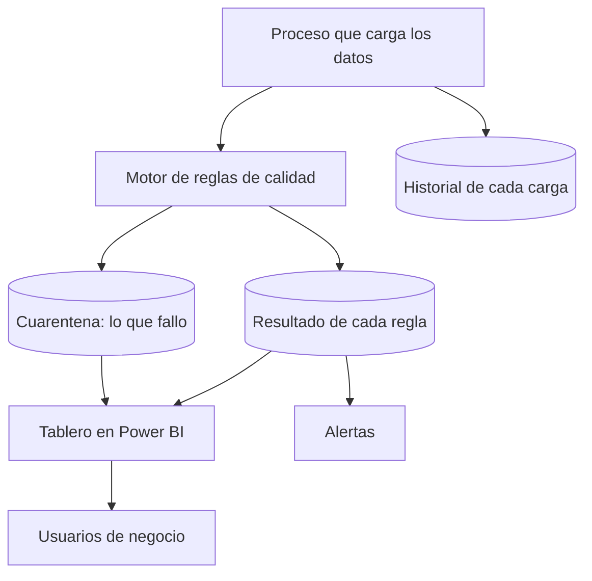

# Ejercicio 2 - Mecanismo de veeduria para la calidda y trazabilidad

## 1. ¿Cuál es el problema?

El datasets del ejercicio uno puede ser correcto técnicamente y aun así no se puede usar. Lo que hace que un área de negocio confíe en un dato no es que exista, sino que pueda comprobarlo por su cuenta sin depender del equipo de datos.

Por eso este mecanismo no es un tablero de monitoreo técnico. Es una herramienta de autogestión para negocio, con dos capacidades:

- **Veeduría**: ¿qué tan bueno es dato hoy y hacia dónde va?

- **Trazabilidad**: ¿de dónde salió este valor específico?


## 2. Las seis cosas que se miden (dimensiones de calidad)

Se usan 6 categorias que son un estandar conocido en la industria (se llaman DAMA-DMBOK), para no inventar criterios propios:

| Categoria | Que pregunta responde | Ejemplo con telefonos |
|---|---|---|
| Completitud | Falta informacion? | % de clientes que tienen al menos un telefono |
| Validez | Cumple el formato? | % de numeros bien normalizados |
| Unicidad | Hay duplicados raros? | % de numeros que se repiten en mas de 3 clientes |
| Consistencia | Las fuentes coinciden? | % de clientes con el mismo numero en todos los sistemas |
| Actualidad | Esta al dia? | % de numeros con mas de 2 anos sin actualizarse |
| Exactitud | Es correcto de verdad? | % de llamadas donde el cliente si contesto |

La exactitud es muy difícil de medir. No se puede comparar con el sistema, solo con la realidad. Por eso se usa el resultado real de las llamadas, como si contestaron o no, para saber si los datos son correctos.

## ¿cómo se arma?


### ¿Cómo se guardan las reglas?

```sql
-- Las reglas se guardan como datos en una tabla, no escritas en el codigo.
-- Asi, agregar una regla nueva no necesita que un programador haga un cambio.
CREATE TABLE regla_calidad (
    id_regla       STRING,
    dataset        STRING,
    dimension      STRING,   -- Completitud, Validez, etc
    descripcion    STRING,   -- explicada en lenguaje simple
    condicion_sql  STRING,   -- lo que se debe cumplir
    umbral_alerta  DECIMAL,  -- si baja de esto, se avisa
    umbral_bloqueo DECIMAL,  -- si baja de esto, se detiene el proceso
    responsable    STRING,
    activa         BOOLEAN
)

-- Aqui se guarda el resultado de cada revision, con fecha,
-- para poder ver si la calidad mejora o empeora con el tiempo.
CREATE TABLE resultado_regla (
    id_corrida      STRING,
    id_regla        STRING,
    fecha           TIMESTAMP,
    total_evaluado  BIGINT,
    total_correcto  BIGINT,
    porcentaje      DECIMAL,
    estado          STRING    -- OK, ALERTA o BLOQUEO
);
```